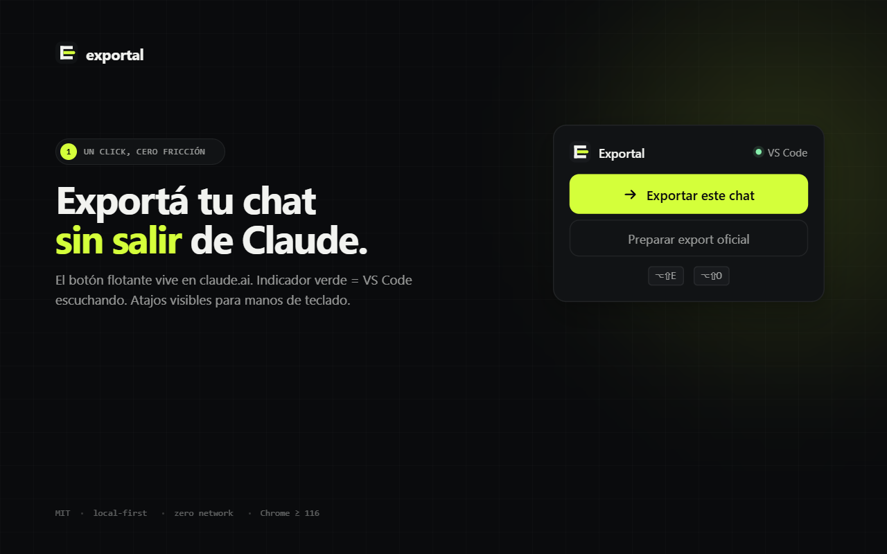
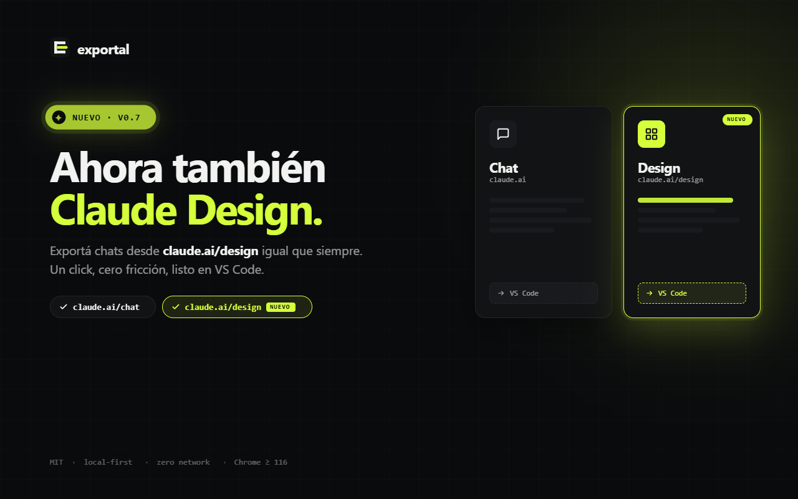
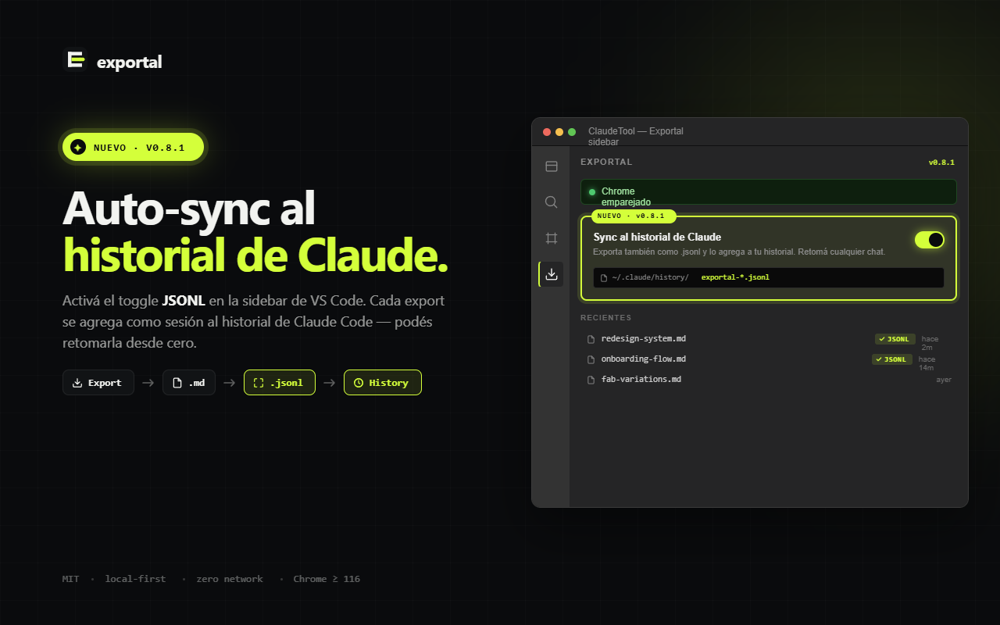
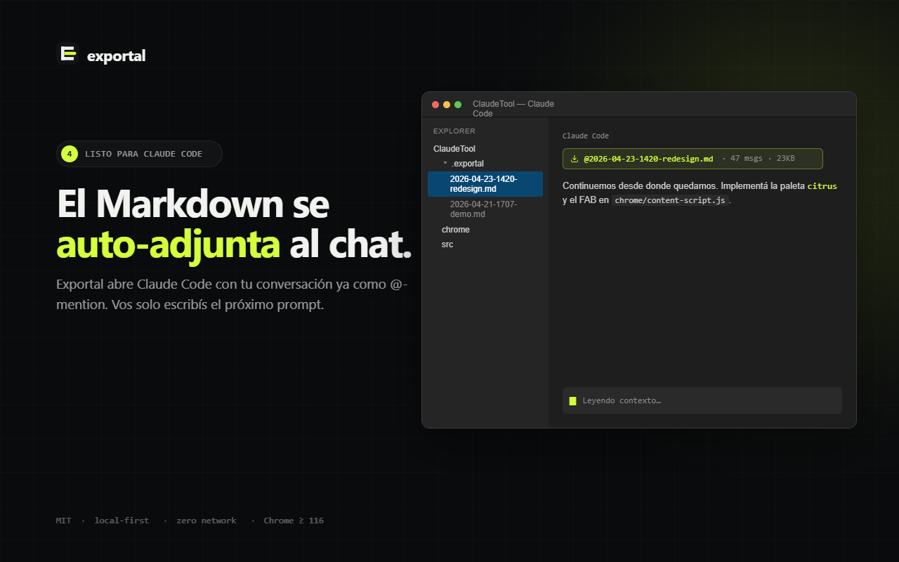
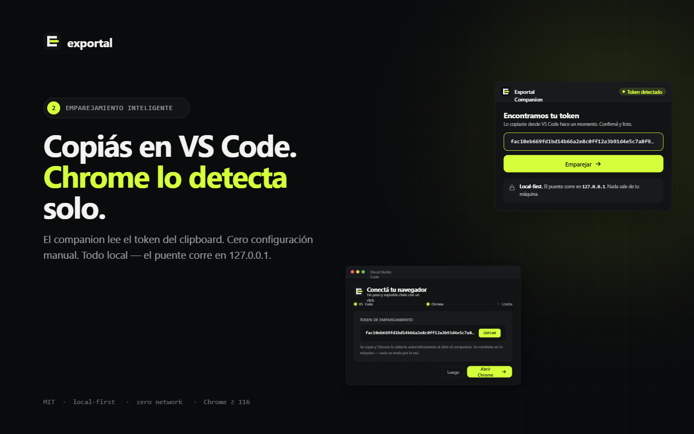
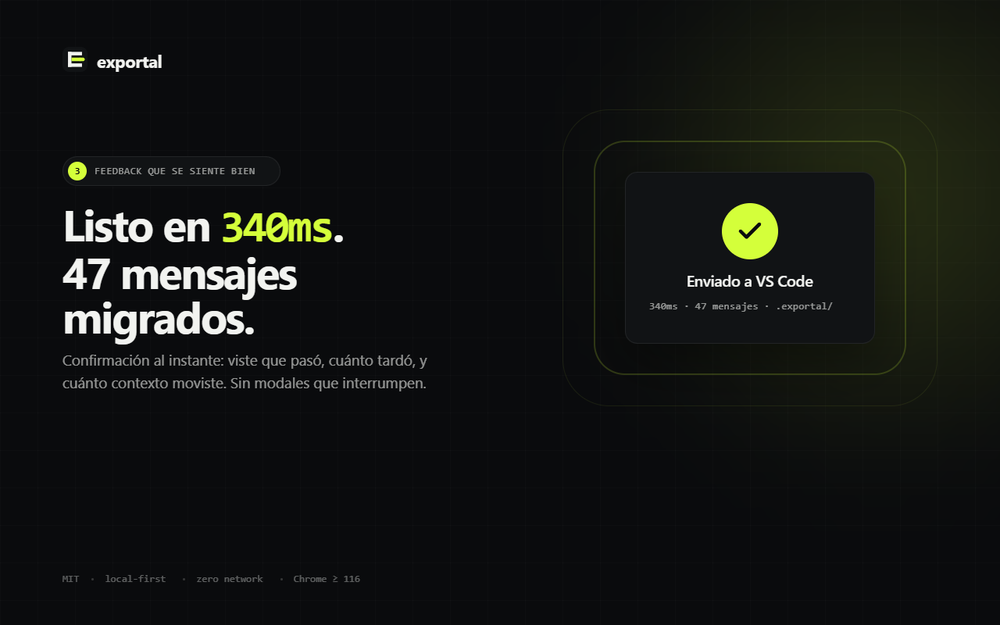

# Exportal

Puente entre **claude.ai / ChatGPT** y **Claude Code** (VS Code). Exportá cualquier chat a Markdown limpio con un click — listo para pegar como contexto en Claude Code, o para enviar una sesión de Claude Code de vuelta a tu chat web.

> **Estado**: bidireccional (claude.ai / ChatGPT ↔ Claude Code). Extensión de VS Code + companion de Chrome + CLI.
> Changelog: [`CHANGELOG.md`](./CHANGELOG.md). Modelo de amenazas: [`SECURITY.md`](./SECURITY.md). Avance detallado: [`DEVLOG.md`](./DEVLOG.md). Qué viene: [`ROADMAP.md`](./ROADMAP.md).

## Qué resuelve

Cuando pasás de claude.ai a Claude Code (o viceversa), perdés todo el contexto y toca re-explicar el proyecto. Exportal genera un Markdown limpio con toda la conversación — incluyendo tool use, pensamientos y resultados — que pegás como contexto inicial.

## Cómo se usa — camino feliz

Con las dos extensiones instaladas y emparejadas:

1. Abrí cualquier chat en `claude.ai/chat/<uuid>`, un proyecto en `claude.ai/design/p/<uuid>`, **o un chat en `chatgpt.com/c/<uuid>`**.
2. Click en el botón flotante de Exportal (esquina inferior derecha) → **Exportar este chat**.
3. VS Code guarda la conversación en `<workspace>/.exportal/<timestamp>-<slug>.md`, abre el archivo, **y automáticamente abre el panel de Claude Code con el Markdown adjunto como `@-mention`**. Solo escribís tu prompt y listo.

> **¿VS Code cerrado?** No problem — el FAB lo detecta y lo abre solo via `vscode://`. La conversación se importa en cuanto el bridge arranca, sin que tengas que tocar nada. La primera vez tu navegador puede pedirte confirmar *"¿Abrir esto con Visual Studio Code?"* — clickeá *"Recordar"* y desaparece para siempre.

En proyectos de **Claude Design**, además del chat se descargan los archivos generados (HTML, JSX, JSON, etc.) a `<workspace>/.exportal/<timestamp>-<slug>/` (carpeta hermana del `.md`). El `.md` arranca con un encabezado *"Generated assets"* listando los archivos para que Claude Code los vea.

O con atajo de teclado (sin abrir el panel):

- `Alt+Shift+E` — exportá el chat actual a VS Code (funciona en `/chat` y `/design/p`).
- `Alt+Shift+O` — preparar el export oficial (solo en `/chat`, por si querés la versión con todos tus chats; la extensión reenvía el ZIP cuando llega por email).

El auto-attach al chat de Claude Code se puede desactivar con el setting `exportal.autoAttachToClaudeCode`. Agregá `.exportal/` a tu `.gitignore` si no querés versionar los imports.



En proyectos de Claude Design la captura del export incluye los archivos generados (HTML, JSX, JSON) en una carpeta hermana del `.md`:



### Al revés: Claude Code → claude.ai / ChatGPT

Desde la tab de Exportal en VS Code, sección **↑ Exportar la sesión actual**, click en `claude.ai` o `ChatGPT`. Toma automáticamente la sesión más reciente de Claude Code (la que estás usando), renderiza el chat a Markdown, lo copia al portapapeles, **guarda el `.md` en `<workspace>/.exportal/`** como fallback, y abre el sitio del proveedor en el browser. Pegás con `Ctrl+V` o arrastrás el `.md` si la sesión es muy larga (claude.ai/ChatGPT truncan pastes >100K caracteres). Ningún proveedor tiene API de escritura — el paso final es manual por diseño.

### Importar desde un .zip de export (claude.ai o ChatGPT)

Si descargás el ZIP de export oficial (claude.ai: *Settings → Export data*; ChatGPT: *Settings → Data controls → Export*), Exportal lo importa con un click:

- Abrí la tab de Exportal. Si descargaste el ZIP recientemente, **el panel lo detecta solo** y muestra el filename + tiempo en la fila del proveedor (verde). Click en la fila → import directo, sin file picker.
- Si no detecta nada, click igual → file picker.
- El watch en tiempo real escucha tu carpeta de Downloads mientras el panel está visible: descargás un ZIP nuevo, en ~1.5 segundos aparece en la fila correspondiente.

### Aparecer en `/resume` de Claude Code (opt-in)

Si activás el setting `exportal.alsoWriteJsonl`, junto al `.md` se escribe un `.jsonl` compatible con Claude Code en `~/.claude/projects/<encoded-cwd>/<sessionId>.jsonl`. La conversación importada aparece directo en `/resume` como si fuera una sesión local del proyecto. Es experimental — el formato `.jsonl` es ingeniería inversa, no oficialmente documentado, y puede romperse entre versiones.



### Tab dedicada en VS Code

Hay un ícono de Exportal en la activity bar (la barra vertical de la izquierda). El panel reúne todo lo importante en una jerarquía clara:

- **Settings** — toggles de `autoAttachToClaudeCode` y `alsoWriteJsonl`.
- **↓ Importar al workspace** — una fila por proveedor (claude.ai, ChatGPT, Gemini coming soon). Click → file picker, o import directo si detectó un ZIP fresco en Downloads.
- **↑ Exportar la sesión actual** — espejo de Importar. Click en `claude.ai` o `ChatGPT` → manda la sesión más reciente de Claude Code al chat web del proveedor.
- **Bridge status** abajo, clickeable. Expande para ver el endpoint, el token de pairing (con copy + **"Copiar y abrir Chrome"** que dispara el auto-pair sin abrir el panel grande) y un atajo a Logs.



## Instalación

### Extensión de VS Code

Desde el [Marketplace](https://marketplace.visualstudio.com/items?itemName=dioniipereyraa.exportal) (recomendado):
- `Ctrl+Shift+X` → buscá **"Exportal"** → Install.

O build local para desarrollar/trabajar con cambios:
```bash
npm install
npm run package:vsix
code --install-extension exportal-*.vsix
```

Al abrir VS Code por primera vez se abre un panel con el **token de emparejamiento** y un botón **"Copiar y abrir Chrome"**. Si te distraés, lo reabrís con `Ctrl+Shift+P` → **Exportal: Mostrar token de emparejamiento**.



### Companion de Chrome

1. Instalá **Exportal Companion** desde Chrome Web Store, o descargá `exportal-companion-<version>.zip` desde [Releases](https://github.com/dioniipereyraa/ClaudeTool/releases) y cargalo sin empaquetar en `chrome://extensions` (Modo desarrollador activado).
2. En VS Code corré **Exportal: Mostrar token de emparejamiento** → click en **Copiar y abrir Chrome**. La primera vez te preguntamos si querés emparejar via **claude.ai** o **chatgpt.com** (el companion vive en los dos sitios, cualquiera funciona como puente). La elección queda recordada; para cambiarla más adelante usá **Exportal: Cambiar proveedor de emparejamiento**. El companion detecta el token automáticamente, abre su página de opciones mostrando *"¡Listo! — Todo conectado"*, y VS Code te avisa con una notification de emparejamiento completo. Sin copiar ni pegar.

El badge del ícono refleja el estado: `OK` verde (importó), `SET` amarillo (falta token), `OFF` rojo (VS Code no responde), `AUTH` rojo (token inválido), `OLD` rojo (VS Code desactualizado), `ERR` rojo (otros).



## Dos formas de exportar

| Método | Cuándo sirve | Qué hace |
|---|---|---|
| **Exportar este chat** (botón o `Alt+Shift+E`) | Querés *este* chat ahora mismo. | Lee la API interna de claude.ai (mismas cookies de sesión), manda el JSON al bridge local de VS Code, abre el Markdown. Cero ZIPs, cero mails. |
| **Preparar export oficial** (botón o `Alt+Shift+O`) | Querés *todos* tus chats, o el export oficial completo con attachments/proyectos. | Guarda el UUID del chat actual. Cuando el ZIP oficial de claude.ai termina de descargar, el companion se lo pasa a VS Code y VS Code abre directo ese chat del listado. |

## CLI (opcional)

Para exportar sesiones de Claude Code a Markdown, o para importar un ZIP de claude.ai desde la terminal:

```bash
# Export de una sesión de Claude Code
npx exportal export <sessionId> --out session.md

# Import desde un ZIP de claude.ai
npx exportal import list ./data-abc.zip              # lista conversaciones
npx exportal import show ./data-abc.zip <uuid>       # renderiza una
```

Ambos comandos redactan secretos por defecto. Ver `--help`.

## Principios

- **Local-first, zero-network**: nada sale de tu máquina.
- **Fail-closed en seguridad**: redacción activa por defecto, tanto en CLI como en extensión.
- **Preview obligatoria** en el CLI antes de escribir un export.
- **Boring tech**: TypeScript estricto, Node 20+, dependencias mínimas.

## Requisitos

- Node.js ≥ 20
- VS Code ≥ 1.85 (para la extensión)

## Desarrollo

```bash
npm install
npm run lint       # ESLint
npm run typecheck  # tsc --noEmit
npm test           # vitest
npm run build      # compila a ./dist (CLI + bundle de extensión)
npm run ci         # todo lo anterior en orden
```

La extensión se debuggea con F5 (abre un Extension Development Host con el bundle fresco).

## Licencia

MIT — ver [`LICENSE`](./LICENSE).
