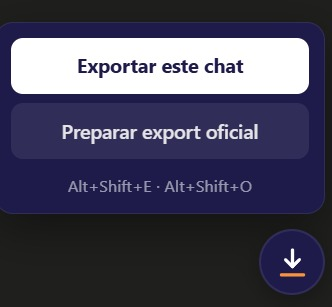
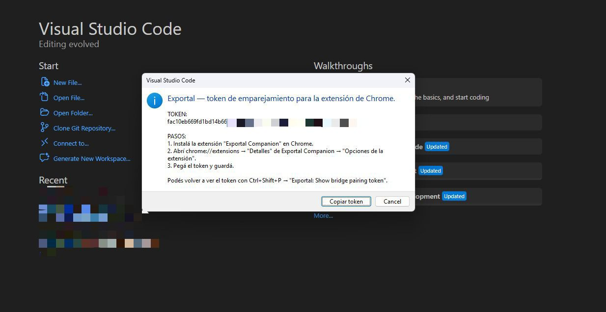
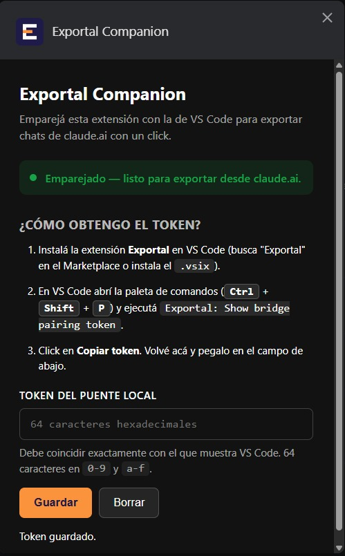

# Exportal

Puente entre **claude.ai** y **Claude Code** (VS Code). Exportá cualquier chat de claude.ai a Markdown limpio con un click o un atajo de teclado — listo para pegar como contexto en Claude Code.

> **Estado**: bidireccional (claude.ai ↔ Claude Code). Extensión de VS Code + companion de Chrome + CLI.
> Changelog: [`CHANGELOG.md`](./CHANGELOG.md). Modelo de amenazas: [`SECURITY.md`](./SECURITY.md). Avance detallado: [`DEVLOG.md`](./DEVLOG.md). Qué viene: [`ROADMAP.md`](./ROADMAP.md).

## Qué resuelve

Cuando pasás de claude.ai a Claude Code (o viceversa), perdés todo el contexto y toca re-explicar el proyecto. Exportal genera un Markdown limpio con toda la conversación — incluyendo tool use, pensamientos y resultados — que pegás como contexto inicial.

## Cómo se usa — camino feliz

Con las dos extensiones instaladas y emparejadas:

1. Abrí cualquier chat en `claude.ai/chat/<uuid>` **o un proyecto en `claude.ai/design/p/<uuid>`**.
2. Click en el botón flotante de Exportal (esquina inferior derecha) → **Exportar este chat**.
3. VS Code guarda la conversación en `<workspace>/.exportal/<timestamp>-<slug>.md`, abre el archivo, **y automáticamente abre el panel de Claude Code con el Markdown adjunto como `@-mention`**. Solo escribís tu prompt y listo.

En proyectos de **Claude Design**, además del chat se descargan los archivos generados (HTML, JSX, JSON, etc.) a `<workspace>/.exportal/<timestamp>-<slug>/` (carpeta hermana del `.md`). El `.md` arranca con un encabezado *"Generated assets"* listando los archivos para que Claude Code los vea.

O con atajo de teclado (sin abrir el panel):

- `Alt+Shift+E` — exportá el chat actual a VS Code (funciona en `/chat` y `/design/p`).
- `Alt+Shift+O` — preparar el export oficial (solo en `/chat`, por si querés la versión con todos tus chats; la extensión reenvía el ZIP cuando llega por email).

El auto-attach al chat de Claude Code se puede desactivar con el setting `exportal.autoAttachToClaudeCode`. Agregá `.exportal/` a tu `.gitignore` si no querés versionar los imports.

### Al revés: Claude Code → claude.ai

`Ctrl+Shift+P` → **Exportal: Send Claude Code session to claude.ai**. Elegís una de las sesiones de Claude Code del proyecto actual, Exportal renderiza el chat a Markdown, lo copia al portapapeles y abre `claude.ai/new`. Pegás con `Ctrl+V` y arrancás un chat nuevo con todo el contexto. claude.ai no tiene API de escritura — el paso de pegar es manual por diseño.



## Instalación

### Extensión de VS Code

Desde el [Marketplace](https://marketplace.visualstudio.com/items?itemName=dioniipereyraa.exportal) (recomendado):
- `Ctrl+Shift+X` → buscá **"Exportal"** → Install.

O build local para desarrollar/trabajar con cambios:
```bash
npm install
npm run package:vsix
code --install-extension exportal-*.vsix
```

Al abrir VS Code por primera vez se abre un panel con el **token de emparejamiento** y un botón **"Copiar y abrir Chrome"**. Si te distraés, lo reabrís con `Ctrl+Shift+P` → **Exportal: Mostrar token de emparejamiento**.



### Companion de Chrome

1. Instalá **Exportal Companion** desde Chrome Web Store, o descargá `exportal-companion-<version>.zip` desde [Releases](https://github.com/dioniipereyraa/ClaudeTool/releases) y cargalo sin empaquetar en `chrome://extensions` (Modo desarrollador activado).
2. En VS Code corré **Exportal: Mostrar token de emparejamiento** → click en **Copiar y abrir Chrome**. El companion detecta el token automáticamente, abre su página de opciones mostrando *"¡Listo! — Todo conectado"*, y VS Code te avisa con una notification de emparejamiento completo. Sin copiar ni pegar.

El badge del ícono refleja el estado: `OK` verde (importó), `SET` amarillo (falta token), `OFF` rojo (VS Code no responde), `AUTH` rojo (token inválido), `OLD` rojo (VS Code desactualizado), `ERR` rojo (otros).



## Dos formas de exportar

| Método | Cuándo sirve | Qué hace |
|---|---|---|
| **Exportar este chat** (botón o `Alt+Shift+E`) | Querés *este* chat ahora mismo. | Lee la API interna de claude.ai (mismas cookies de sesión), manda el JSON al bridge local de VS Code, abre el Markdown. Cero ZIPs, cero mails. |
| **Preparar export oficial** (botón o `Alt+Shift+O`) | Querés *todos* tus chats, o el export oficial completo con attachments/proyectos. | Guarda el UUID del chat actual. Cuando el ZIP oficial de claude.ai termina de descargar, el companion se lo pasa a VS Code y VS Code abre directo ese chat del listado. |

## CLI (opcional)

Para exportar sesiones de Claude Code a Markdown, o para importar un ZIP de claude.ai desde la terminal:

```bash
# Export de una sesión de Claude Code
npx exportal export <sessionId> --out session.md

# Import desde un ZIP de claude.ai
npx exportal import list ./data-abc.zip              # lista conversaciones
npx exportal import show ./data-abc.zip <uuid>       # renderiza una
```

Ambos comandos redactan secretos por defecto. Ver `--help`.

## Principios

- **Local-first, zero-network**: nada sale de tu máquina.
- **Fail-closed en seguridad**: redacción activa por defecto, tanto en CLI como en extensión.
- **Preview obligatoria** en el CLI antes de escribir un export.
- **Boring tech**: TypeScript estricto, Node 20+, dependencias mínimas.

## Requisitos

- Node.js ≥ 20
- VS Code ≥ 1.85 (para la extensión)

## Desarrollo

```bash
npm install
npm run lint       # ESLint
npm run typecheck  # tsc --noEmit
npm test           # vitest
npm run build      # compila a ./dist (CLI + bundle de extensión)
npm run ci         # todo lo anterior en orden
```

La extensión se debuggea con F5 (abre un Extension Development Host con el bundle fresco).

## Licencia

MIT — ver [`LICENSE`](./LICENSE).
