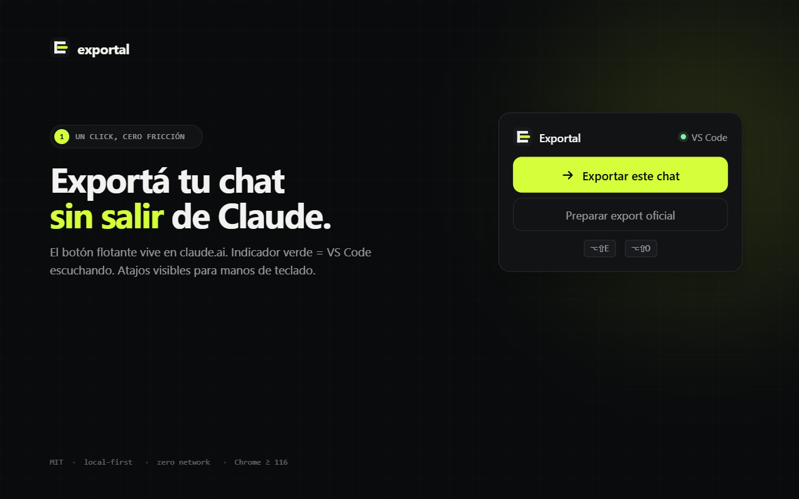
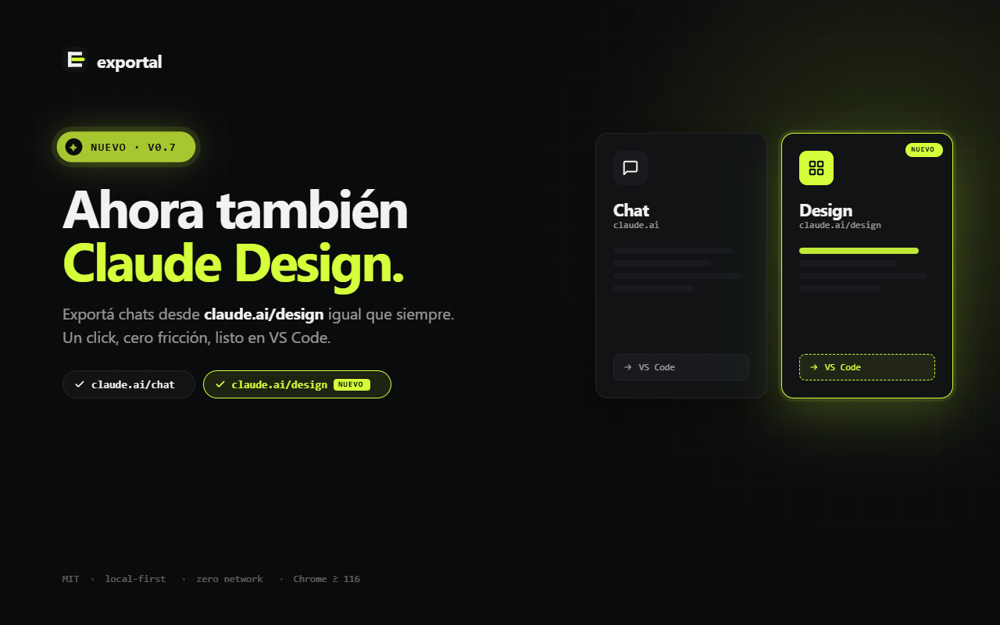
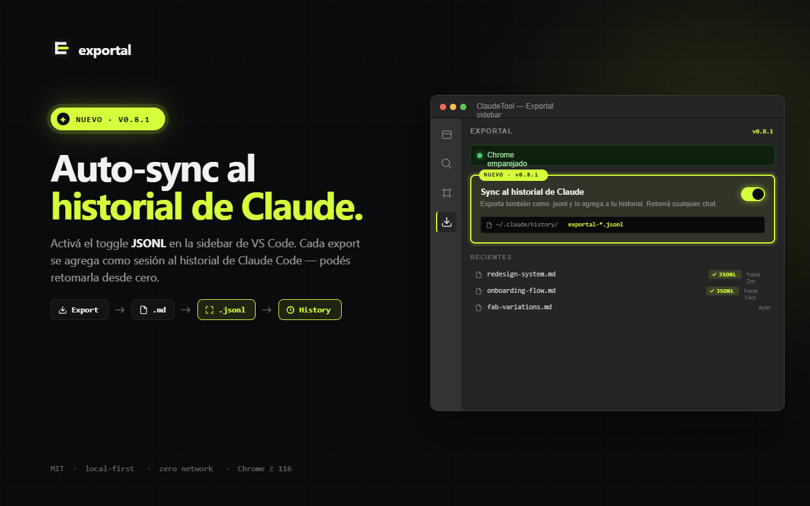
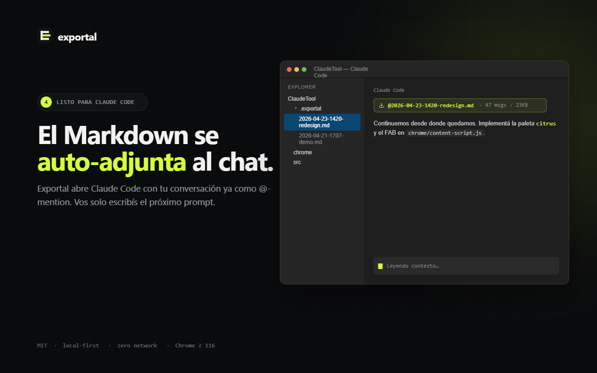
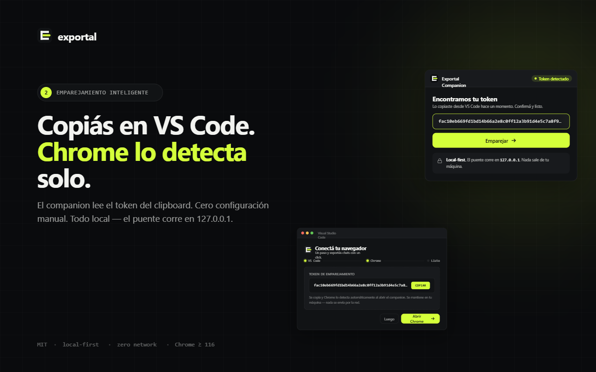
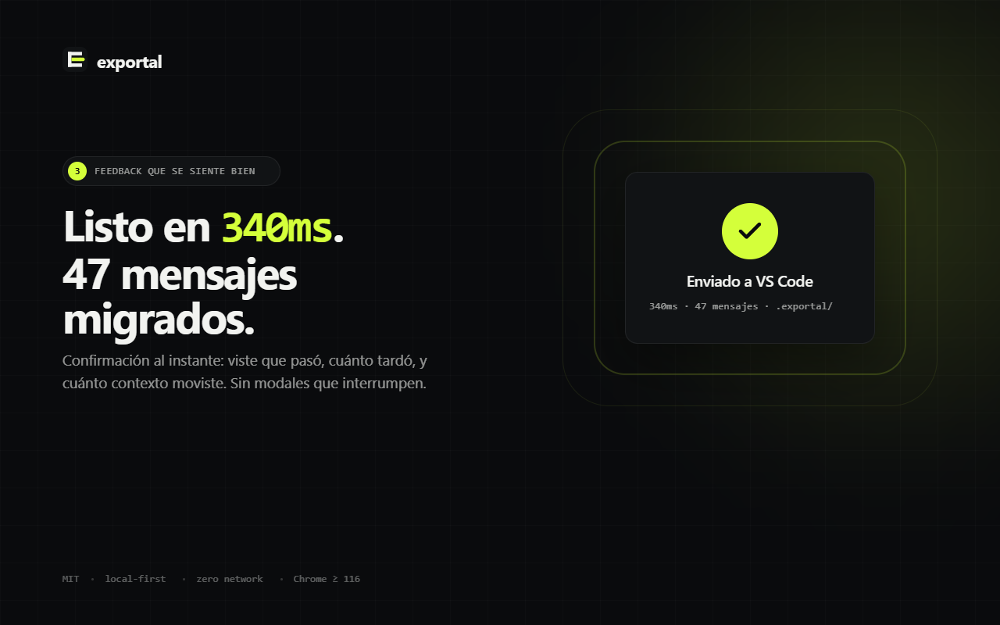

# Exportal

Bridge between **claude.ai / ChatGPT** and **Claude Code** (VS Code). Export any chat to clean Markdown with one click — ready to paste as context into Claude Code, or to send a Claude Code session back to your web chat.

> **Status**: bidirectional (claude.ai / ChatGPT ↔ Claude Code). VS Code extension + Chrome companion + CLI.
> Changelog: [`CHANGELOG.md`](./CHANGELOG.md). Threat model: [`SECURITY.md`](./SECURITY.md). Detailed progress: [`DEVLOG.md`](./DEVLOG.md). What's coming: [`ROADMAP.md`](./ROADMAP.md).

## What it solves

When you switch from claude.ai to Claude Code (or vice versa), you lose all the context and have to re-explain your project. Exportal generates a clean Markdown file with the entire conversation — including tool use, thinking, and results — that you paste in as initial context.

## How to use it — happy path

With both extensions installed and paired:

1. Open any chat at `claude.ai/chat/<uuid>`, a project at `claude.ai/design/p/<uuid>`, **or a chat at `chatgpt.com/c/<uuid>`**.
2. Click the floating Exportal button (bottom-right corner) → **Export this chat**.
3. VS Code saves the conversation to `<workspace>/.exportal/<timestamp>-<slug>.md`, opens the file, **and automatically opens the Claude Code panel with the Markdown attached as `@-mention`**. You just write your prompt and you're done.

> **VS Code closed?** No problem — the FAB detects it and opens it automatically via `vscode://`. The conversation is imported as soon as the bridge starts, without you having to do anything. The first time, your browser may ask you to confirm *"Open this with Visual Studio Code?"* — click *"Remember"* and it disappears forever.

For **Claude Design** projects, in addition to the chat, the generated assets (HTML, JSX, JSON, etc.) are downloaded to `<workspace>/.exportal/<timestamp>-<slug>/` (sibling folder of the `.md`). The `.md` starts with a *"Generated assets"* header listing the files so Claude Code sees them.

Or with a keyboard shortcut (without opening the panel):

- `Alt+Shift+E` — export the current chat to VS Code (works on `/chat` and `/design/p`).
- `Alt+Shift+O` — prepare the official export (only on `/chat`, in case you want the version with all your chats; the extension forwards the ZIP when it arrives by email).

Auto-attach to the Claude Code chat can be disabled with the `exportal.autoAttachToClaudeCode` setting. Add `.exportal/` to your `.gitignore` if you don't want to version the imports.



For Claude Design projects, the export capture includes the generated files (HTML, JSX, JSON) in a sibling folder of the `.md`:



### The other way around: Claude Code → claude.ai / ChatGPT

From the Exportal tab in VS Code, **↑ Export current session** section, click `claude.ai` or `ChatGPT`. It automatically picks the most recent Claude Code session (the one you're using), renders the chat to Markdown, copies it to the clipboard, **saves the `.md` to `<workspace>/.exportal/`** as a fallback, and opens the provider's site in the browser. You paste with `Ctrl+V` or drag the `.md` if the session is too long (claude.ai/ChatGPT truncate pastes >100K characters). No provider has a write API — the final step is manual by design.

### Import from a .zip export (claude.ai or ChatGPT)

If you download the official export ZIP (claude.ai: *Settings → Export data*; ChatGPT: *Settings → Data controls → Export*), Exportal imports it with one click:

- Open the Exportal tab. If you downloaded the ZIP recently, **the panel detects it automatically** and shows the filename + time on the provider's row (green). Click the row → direct import, no file picker.
- If it doesn't detect anything, click anyway → file picker.
- Real-time watch listens to your Downloads folder while the panel is visible: download a new ZIP and in ~1.5 seconds it shows up on the corresponding row.

### Show up in Claude Code's `/resume` (opt-in)

If you enable the `exportal.alsoWriteJsonl` setting, alongside the `.md` a `.jsonl` compatible with Claude Code is written to `~/.claude/projects/<encoded-cwd>/<sessionId>.jsonl`. The imported conversation shows up directly in `/resume` as if it were a local session of the project. It's experimental — the `.jsonl` format is reverse-engineered, not officially documented, and may break between versions.



### Dedicated tab in VS Code

There's an Exportal icon in the activity bar (the left vertical bar). The panel brings everything important together in a clear hierarchy:

- **Settings** — toggles for `autoAttachToClaudeCode` and `alsoWriteJsonl`.
- **↓ Import to workspace** — one row per provider (claude.ai, ChatGPT, Gemini coming soon). Click → file picker, or direct import if it detected a fresh ZIP in Downloads.
- **↑ Export current session** — mirror of Import. Click `claude.ai` or `ChatGPT` → sends the most recent Claude Code session to the provider's web chat.
- **Bridge status** at the bottom, clickable. Expand to see the endpoint, the pairing token (with copy + **"Copy and open Chrome"** that triggers auto-pair without opening the big panel) and a shortcut to Logs.



## Installation

### VS Code extension

From the [Marketplace](https://marketplace.visualstudio.com/items?itemName=dioniipereyraa.exportal) (recommended):
- `Ctrl+Shift+X` → search for **"Exportal"** → Install.

Or local build to develop/work with changes:
```bash
npm install
npm run package:vsix
code --install-extension exportal-*.vsix
```

When you open VS Code for the first time, a panel opens with the **pairing token** and a **"Copy and open Chrome"** button. If you get distracted, you can reopen it with `Ctrl+Shift+P` → **Exportal: Show pairing token**.



### Chrome companion

1. Install **Exportal Companion** from the Chrome Web Store, or download `exportal-companion-<version>.zip` from [Releases](https://github.com/dioniipereyraa/ClaudeTool/releases) and load it unpacked in `chrome://extensions` (Developer mode enabled).
2. In VS Code, run **Exportal: Show pairing token** → click **Copy and open Chrome**. The first time, we ask you whether you want to pair via **claude.ai** or **chatgpt.com** (the companion lives on both sites, either works as a bridge). The choice is remembered; to change it later, use **Exportal: Change pairing provider**. The companion detects the token automatically, opens its options page showing *"Done! — All connected"*, and VS Code notifies you with a pairing-complete notification. No copy, no paste.

The icon badge reflects the state: `OK` green (imported), `SET` yellow (token missing), `OFF` red (VS Code not responding), `AUTH` red (invalid token), `OLD` red (VS Code outdated), `ERR` red (others).



## Two ways to export

| Method | When it's useful | What it does |
|---|---|---|
| **Export this chat** (button or `Alt+Shift+E`) | You want *this* chat right now. | Reads claude.ai's internal API (same session cookies), sends the JSON to the local VS Code bridge, opens the Markdown. No ZIPs, no emails. |
| **Prepare official export** (button or `Alt+Shift+O`) | You want *all* your chats, or the full official export with attachments/projects. | Saves the UUID of the current chat. When the official claude.ai ZIP finishes downloading, the companion forwards it to VS Code and VS Code opens that chat directly from the list. |

## CLI (optional)

To export Claude Code sessions to Markdown, or to import a claude.ai ZIP from the terminal:

```bash
# Export a Claude Code session
npx exportal export <sessionId> --out session.md

# Import from a claude.ai ZIP
npx exportal import list ./data-abc.zip              # list conversations
npx exportal import show ./data-abc.zip <uuid>       # render one
```

Both commands redact secrets by default. See `--help`.

## Principles

- **Local-first, zero-network**: nothing leaves your machine.
- **Fail-closed on security**: redaction enabled by default, both in CLI and extension.
- **Mandatory preview** in the CLI before writing an export.
- **Boring tech**: strict TypeScript, Node 20+, minimal dependencies.

## Requirements

- Node.js ≥ 20
- VS Code ≥ 1.85 (for the extension)

## Development

```bash
npm install
npm run lint       # ESLint
npm run typecheck  # tsc --noEmit
npm test           # vitest
npm run build      # compile to ./dist (CLI + extension bundle)
npm run ci         # all of the above in order
```

The extension is debugged with F5 (opens an Extension Development Host with the fresh bundle).

## License

MIT — see [`LICENSE`](./LICENSE).
